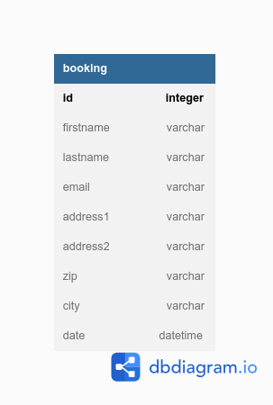

# medical-center

## Dictionnaire des données

| Table   | Champs    | Type     | Commentaire       | Description |
|---------|-----------|----------|-------------------|-------------|
| Booking | id        | int      | A.I, PK, not null |             |
|         | firstname | varchar  | not null          |             |
|         | lastname  | varchar  | not null          |             |
|         | date      | datetime | not null          |             |
|         | email     | varchar  | not null          |             |
|         | adress1   | varchar  | not null          |             |
|         | adress2   | varchar  |                   |             |
|         | zip       | varchar  | not null          |             |
|         | city      | varchar  | not null          |             |

## MCD

## Configuration de la base de données
- copier le fichier de configuration avec `cp config.dist.ini config.ini`
- remplir les informations de connexion à la base de données